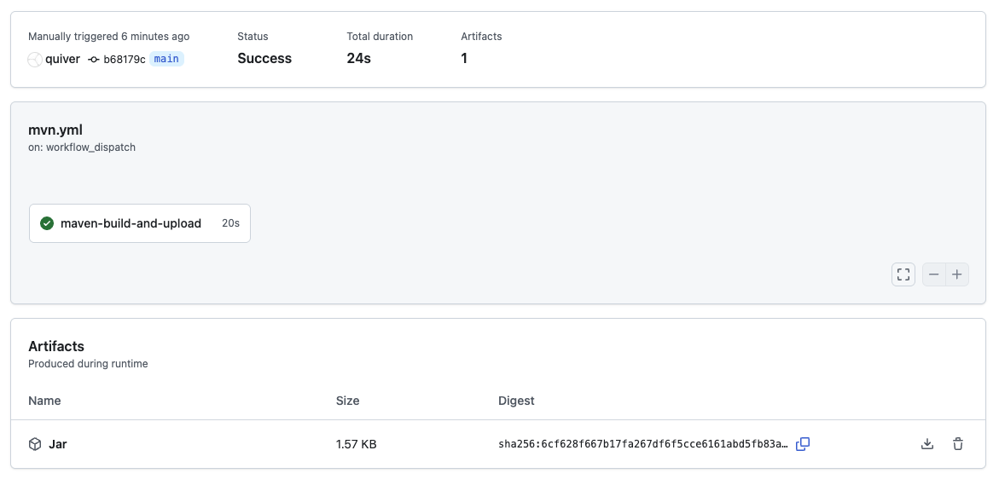

# Maven JAR Build & Upload Demo ワークフロー

MavenでJARファイルを作成し、GitHub Actionsで自動ビルド・アップロードするサンプルです。

## 使用方法

1. GitHubの **Actions** タブを開く
2. **maven jar build & upload demo** を選択
3. **Run workflow** で手動実行し、ブランチを選択

## 処理内容

- `mvn package` でJARファイル作成
- `target/*.jar` を `Jar.zip` に圧縮してアップロード

## ダウンロード

実行完了後、Actionsページから `Jar.zip` をダウンロードできます。

